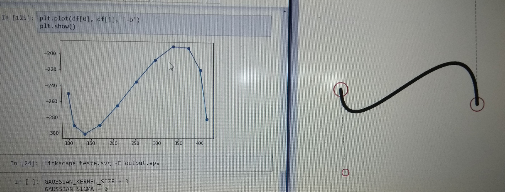
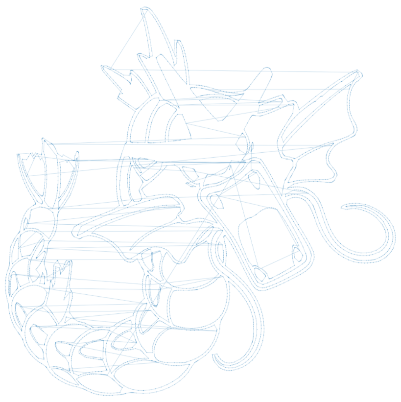
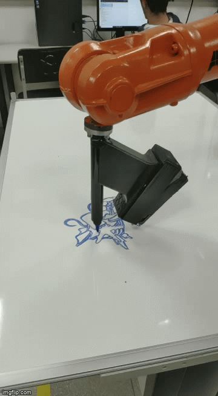
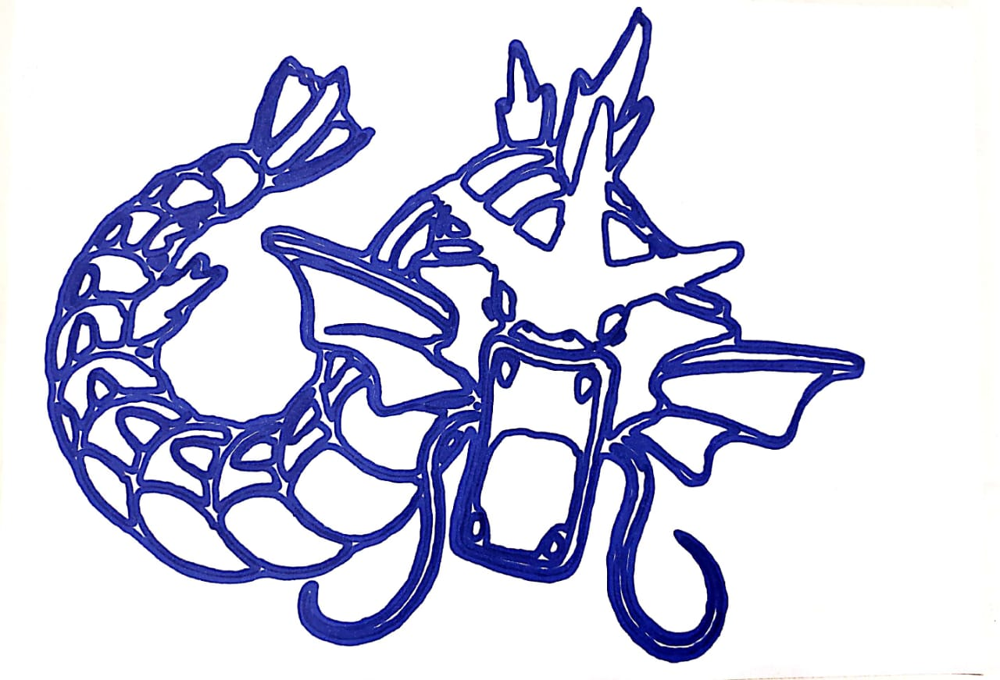

# Robotic Arm Code Generator

**Authors:**
- Pedro Gabriel Gengo Lourenco
- Gustavo Silva de Paula

## 1. Introduction

This was the final project of "Introduction to Robotics", a subject of Mechatronics Engineer. In this project, the main goal was develop a code, similar to gcode, to make the robotic arm draw something. In order to make this reproducible and agnostic to any drawing, we developed a pipeline to open, process and transform the image and, after that, generate the code to share with the robot.

## 2. Technologies

In this project we used:

- Python
- Pandas (to store and view the coordinates)
- PIL (to interact with the image)
- Matplolib (to get a preview of the robot execution)
- Potrace (to transform the image into a SVG)

## 3. Methodology

We can divide the pipeline into 3 steps:

1. Open and process the image
2. Transform into SVG
3. Generate the code

### 3.1. Open and process the image

In this step the main goal was to transform any image into a format where we can apply the potrace and transform into a SVG. So, we need to have an image with the following pattern:

- Jpeg
- Gray scale
- Only edges

So, we apply some transformation to achieve this. The first one was check if the image was a jpeg, and if no, transform to a jpeg. After that we open the jpeg image in gray scale mode and apply the Adaptative Threshold to generate a bitmap image.

### 3.2. Transform into SVG

In this step we used the potrace CLI to receive as input a bitmap image and return a SVG image.

### 3.3. Generate the code

Here we had the most challenging step because we need to understand the SVG sintax and create a code to transform this syntax into robotic syntax. One important concept to understand is the concept of path into a SVG. The path is a "code" which open and close a figure, so, in an image, we can had a lot of path, because our image is build of figures.

So, the first step was to separate the paths to iterate over. After that we need to verify the commands and transform into robotic command. The upper case means absolute position and the lower case means relative position. Above, we had an explanation of SVG commands:

- **L**: linear movement, using x and y coordinates;
- **V**: vertical movement, only y;
- **H**: Horizontal movement, only x; 
- **C**: curve, using the bezier notation (we need to break this curve into data points, as you can see above);
- **M**: Move to another point, but without draw a line.

*Breaking bezier curve*

After this command transformation, we save the .mod code and share with the robot, to execute the drawing. Above, we can see a preview of the execution, using matplotlib:

*Execution Preview*

## Results

Here, you can the see a video showing the robot in action and the final drawing made by the robot!

*Done*
